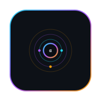
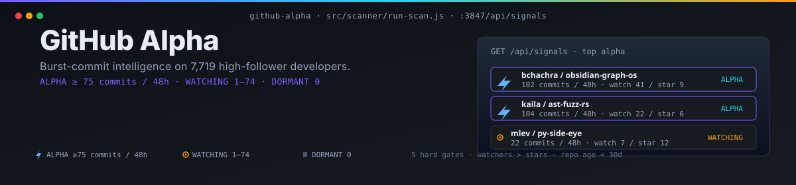

<p align="center">
  <a href="https://github.com/TR3-AI/github-alpha"></a>
</p>

<p align="center">
  <a href="https://github.com/TR3-AI/github-alpha/blob/main/LICENSE"></a>
  
  
  
  
  
  
</p>

<p align="center">
  <sub>GitHub developer intelligence pipeline. Scans 7,719 high-follower devs, finds obscure new personal repos with burst-commit activity, surfaces them to the Action Control dashboard via an HTTP API on :3847.</sub>
</p>

---

<p align="center">
  
</p>

---

> **What this is.** A Node.js pipeline that watches 7,719 high-follower GitHub developers for new personal-repo activity, runs each candidate through five hard gates (not-org, not-fork, personal namespace, repo age < 30 days, watchers > stars), and ships ALPHA-tagged signals to the Action Control dashboard on `:3847`. One full scan per day at 11:00 UTC, plus a six-hourly hot re-scan.

---

## Table of Contents

- [Quick Start](#quick-start)
- [Signal Tiers](#signal-tiers)
- [API Endpoints](#api-endpoints)
- [Schedule (PM2)](#schedule-pm2)
- [Repo Layout](#repo-layout)
- [Mission Control Integration](#mission-control-integration)
- [License](#license)

## Quick Start

```bash
git clone https://github.com/TR3-AI/github-alpha.git
cd github-alpha
npm install
export GITHUB_TOKEN=ghp_...        # or rely on `gh auth token`

npm run scan:test                  # 20-dev sanity check, ~1 min
npm run scan:hot                   # re-scan HOT-tagged devs from last 24h
npm run scan                       # full scan, all 7,719 devs, ~75 min @ batch 10
npm run api                        # start HTTP API on :3847
```

Production:

```bash
pm2 start ecosystem.config.cjs     # api + cron-scheduled scans
pm2 save                           # persist for resurrect
# Windows: install pm2-windows-startup, or schedule `pm2 resurrect` via Task Scheduler
```

The pipeline writes a SQLite database at `data/alpha.db`; raw dev metadata lives alongside it. Set `SUPABASE_URL` and `SUPABASE_SERVICE_ROLE_KEY` to also mirror the signal table upstream (optional).

---

## Signal Tiers

| Signal | commits / 48h | Description |
| --- | --- | --- |
| ⚡ ALPHA | ≥ 75 | All five hard gates passed — pre-launch signal |
| 👁 WATCHING | 1 – 74 | Activity but below velocity threshold |
| — DORMANT | 0 | No qualifying activity |

The five ALPHA hard gates, in order:

1. **Not org repo** — owner is a person, not an organization.
2. **Not a fork** — original work, not a copy.
3. **Personal namespace** — `repo.owner.login === target.login` (the dev owns the repo).
4. **Repo age < 30 days** — created within the last month.
5. **Watchers > Stars** — the obscurity gate. A repo that is being watched more than starred is the pattern that precedes a launch.

> The five-gate set overrides Project Alpha PRD v1.0 §5.4 / §6 thresholds (50/30) and the `< 10 stars` cap. Star count is still surfaced in the UI but does not gate classification. There is no HOT tier — only ALPHA matters.

---

## API Endpoints

| Endpoint | Method | Description |
| --- | --- | --- |
| `/api/health` | GET | Liveness — returns `{ ok: true, ts }` |
| `/api/stats` | GET | Aggregate counts: `{ targets, apiCallsPerDay, filtered, alpha, hot }` |
| `/api/signals` | GET | Latest signal per repo with gate results and 48h commit windows |

The HTTP layer (`src/api/`) is a thin Express-style server. The Action Control dashboard's `Project Alpha` panel is the only consumer — the server binds to `:3847` and is not internet-exposed.

---

## Schedule (PM2)

`ecosystem.config.cjs` declares three services:

| Service | Schedule | Purpose |
| --- | --- | --- |
| `alpha-api` | always-on | HTTP API on `:3847` for Action Control |
| `alpha-daily-scan` | `0 11 * * *` (11:00 UTC) | Full scan of all 7,719 developers |
| `alpha-hot-rescan` | every 6h | Re-scan repos tagged HOT in the last 24h |

PM2 is the process manager. `pm2 save` persists the process list across reboots; on Windows, install `pm2-windows-startup` or schedule `pm2 resurrect` via Task Scheduler.

---

## Repo Layout

```
github-alpha/
├── data/                  # SQLite db (alpha.db) + raw dev dataset
├── scripts/
│   ├── collect-1k-followers.js   # one-shot: pull 1k+ follower devs via GitHub API
│   └── seed-developers.js        # one-shot: seed developers table from collected data
├── src/
│   ├── analyzers/         # per-signal analyses (commit velocity, watchers vs stars, …)
│   ├── api/               # HTTP server on :3847
│   ├── collectors/        # GitHub API clients (GraphQL fetchers)
│   ├── db/                # schema + better-sqlite3 wrapper
│   └── scanner/           # 6-stage filter pipeline + run-scan orchestrator
├── docs/assets/           # README logo + hero
├── ecosystem.config.cjs   # PM2 process manifest
├── package.json
└── README.md
```

---

## Mission Control Integration

github-alpha feeds the **Project Alpha card** in the Action Control dashboard (`TR3-AI/action-control`):

- Top developers by recent commit velocity
- ALPHA-tagged obscure new repos with their five-gate result
- Cross-reference with the wiki entity table for trading / tech signal overlap

The Action Control API consumer is `/api/trending` and `/api/alpha`; this service is the upstream source of truth for both.

---

## License

[MIT](LICENSE). © TR3-AI.
